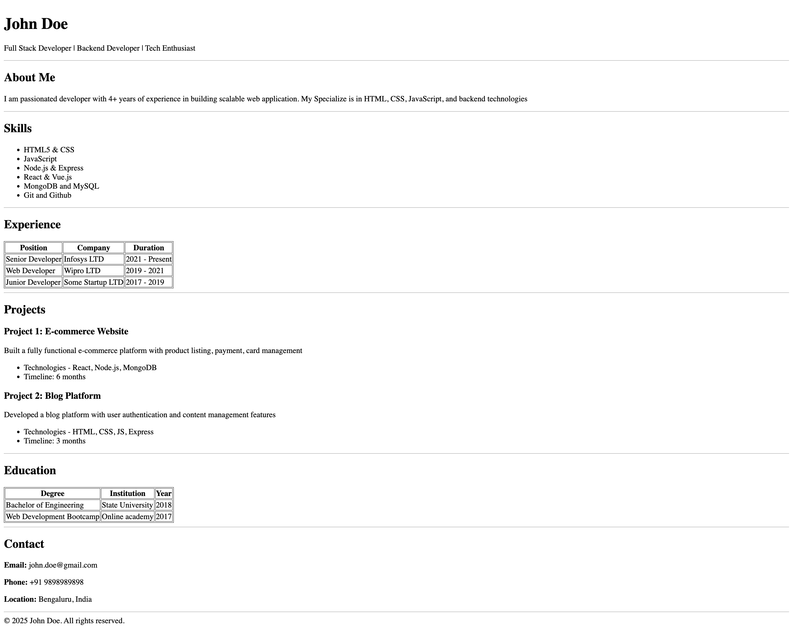

# HTML Resume Page Assignment

A simple HTML resume page showcasing basic HTML elements including headings, paragraphs, lists, tables, and styling.

## Files

- `html-resume-page-assignment.html` - Resume page for John Doe (Full Stack Developer)

## How to Run with Live Server

### Prerequisites

- [Visual Studio Code](https://code.visualstudio.com/) installed
- [Live Server Extension](https://marketplace.visualstudio.com/items?itemName=ritwickdey.LiveServer) installed

### Steps to Run

1. **Install Live Server Extension** (if not already installed):
   - Open VS Code
   - Go to Extensions (`Cmd+Shift+X` on Mac or `Ctrl+Shift+X` on Windows)
   - Search for "Live Server"
   - Click Install on "Live Server" by Ritwick Dey

2. **Open the HTML file**:
   - Open `html-resume-page-assignment.html` in VS Code

3. **Start Live Server** (choose one method):
   - **Method 1**: Right-click on the HTML file in the editor and select "Open with Live Server"
   - **Method 2**: Click the "Go Live" button in the bottom-right status bar
   - **Method 3**: Press `Alt+L Alt+O` (Windows) or `Cmd+L Cmd+O` (Mac)

4. **View in Browser**:
   - Your default browser will open automatically at `http://127.0.0.1:5500/html-assignments/html-resume-page-assignment.html`
   - Any changes you make to the HTML file will automatically refresh in the browser

### Stop Live Server

- Click "Port: 5500" in the status bar, or
- Right-click and select "Stop Live Server"
