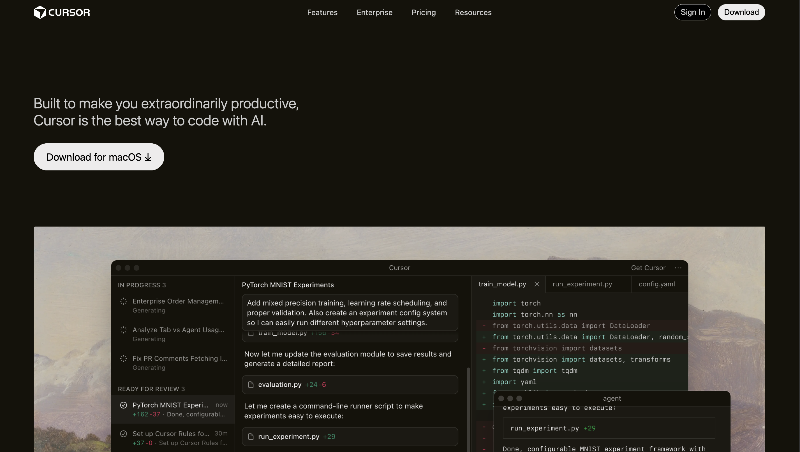

# Cursor Clone Landing Page

A static landing page clone of the Cursor website built with HTML and CSS.

## Project Structure

```
landing-page-assignment /
├── index.html      # Main HTML file
├── style.css       # Stylesheet
├── assets/         # Images and media files
│   ├── logo.svg
│   ├── hero-ss.png
│   ├── img1.png, img-2.png, img-3.png
│   ├── diana-hu.png, shadcn.png, andrej.png, etc.
│   └── fr-1.png, fr-2.mov, fr-3.png, cta.png
└── readme.md       # This file
```

## Video Demo

[Cursor Clone Landing Page Demo](https://www.loom.com/share/6bdce5048fdb42ba9ce13fee88b0267d)



## How to Run

### Option 1: Copy the github repository link and clone it to your local machine

### Option 2: Open Directly in Browser

1. Navigate to the `landing-page-assignment` folder
2. Open on `index.html`
3. right-click and open with live server or open with your default browser
4. The page will open in your default browser

### Option 3: Using VS Code Live Server

1. Open the `landing-page-assignment` folder in VS Code
2. Install the "Live Server" extension if not already installed
3. Right-click on `index.html` and select **"Open with Live Server"**
4. The page will open at `http://127.0.0.1:5500`

## Features

- Responsive navigation bar
- Hero section with download CTA
- Partner logos section
- Feature cards with images
- Testimonials grid
- Changelog section
- Footer with multiple link columns

## Technologies Used

- HTML5
- CSS3
